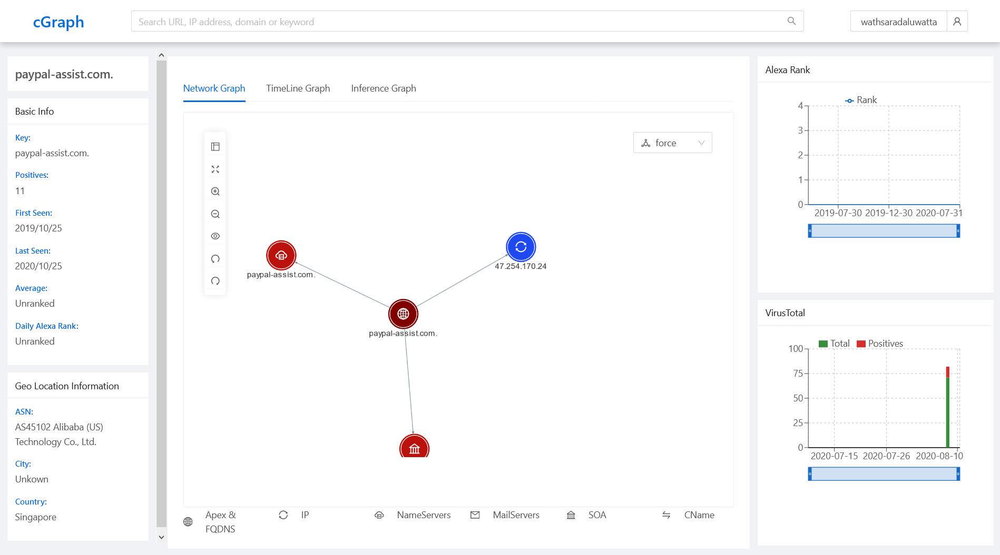
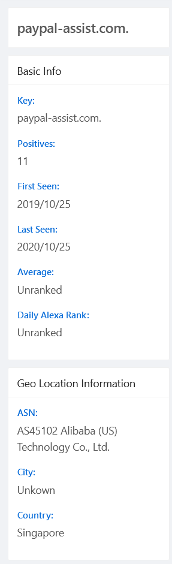
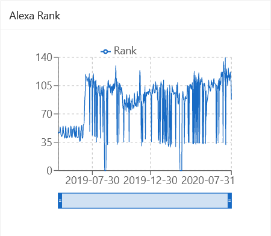
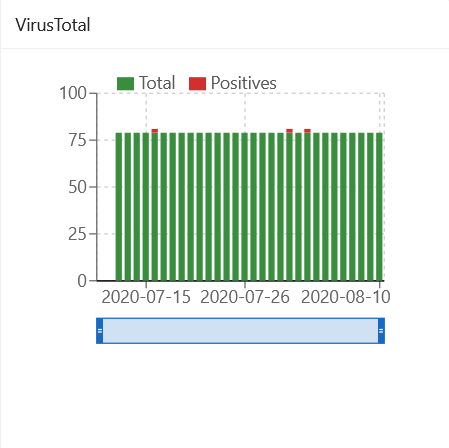
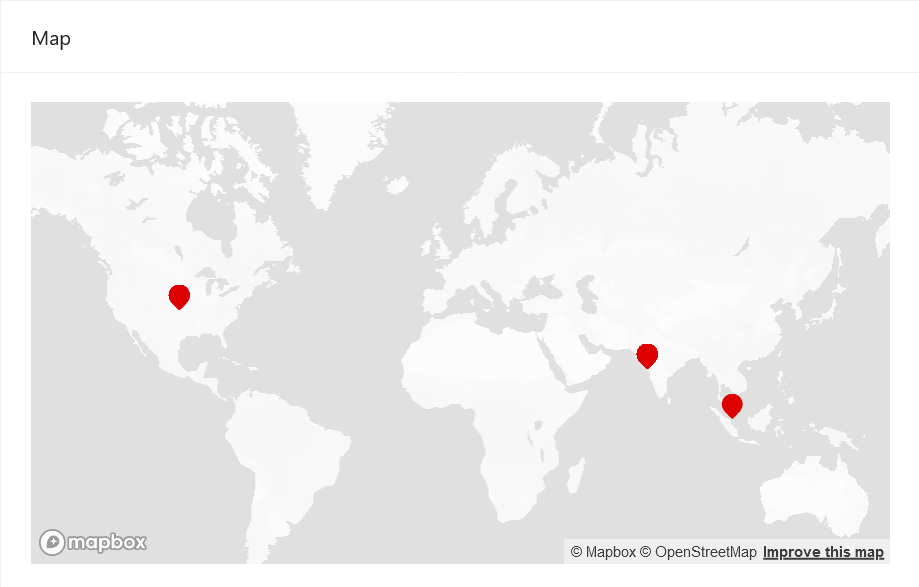

# Quick Start

## cGraph: Graph Interface

An investigator may pick any of these domains to further investigate (Let’s select paypal-assist.com). This takes the investigator to the graph based interface.
  
Below image shows the initial information shown for the domain paypal-assit.com; it includes the domain summary information, network graph, timelinegraph, Inference graph, Alexa ranking and VT counts over time, IP geolocation information and Passive DNS information. 

  
Below list  shows the components in the interface. 
<ul>
<li>Domain Summary   
This Panel shows the summary information of the selected node (Initially the root of the graph) based on current date in the network graph.

 </li>

<li>Alexa Rank  
This Panel shows how the alexa rank has changed over time in the selcted node (Initially the root of the graph). If the domain is not ranked in within the first 1M it does not show the information in the line graph. This graph is a timeseries graph and can change the time draging the bar in the bottom.
</li>

<li>Virus Total Positives  
This Panel shows how the virus total results has changed over time in the selcted node (Initially the root of the graph). If the domain is not searched it does not show the information in the stack graph. This graph is a timeseries graph and can change the time draging the bar in the bottom. Since it is a Stck graph The green bar shows the number of virus gurds mentioned that the doamin is benign and the red color is to show the number of virus guards mentioned that domain is malicious

</li>

<li>Map  
This Panel shows how the the geo location of the nodes is the network graph.
</li>

</ul>
