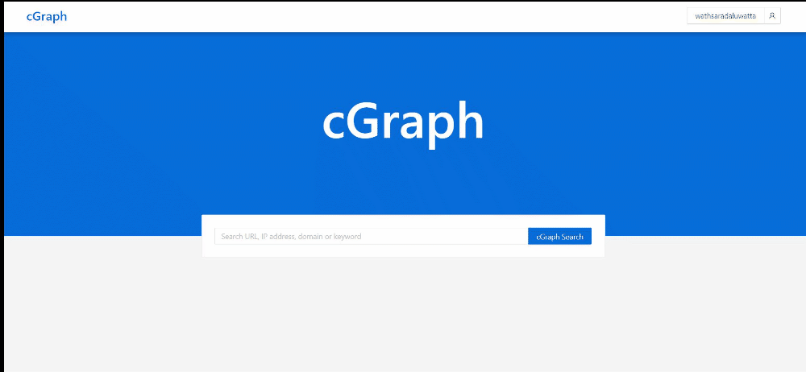

# Quick Start

## cGraph: Search home

Attackers increasingly impersonate popular brands such as Apple, Paypal and Microsoft. Out ofall impersonation attacks, combosquatting domains are the most prevalent. cGraph allows to search for any popular brands and easily identify likely combosquatting domains.
  
Below gif shows the search results for the keyword paypal ordered in the descending order of First seen of the domains. 

