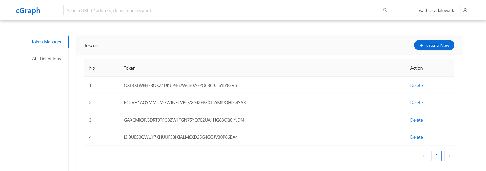

# Quick Start

## cGraph: Token Manager

For researchers or people who need to do some research using our data. We have exposed
apis publicly to access the data. But users need to have a unique access token and their
JWT token. They could have this from the token Manager page in the web
application.
 
These public apis are secured with the tokens and JWT tokens. Whenever
the requests are coming the API validates both the JWT token and the token before
retrieving the data to the public users

  

